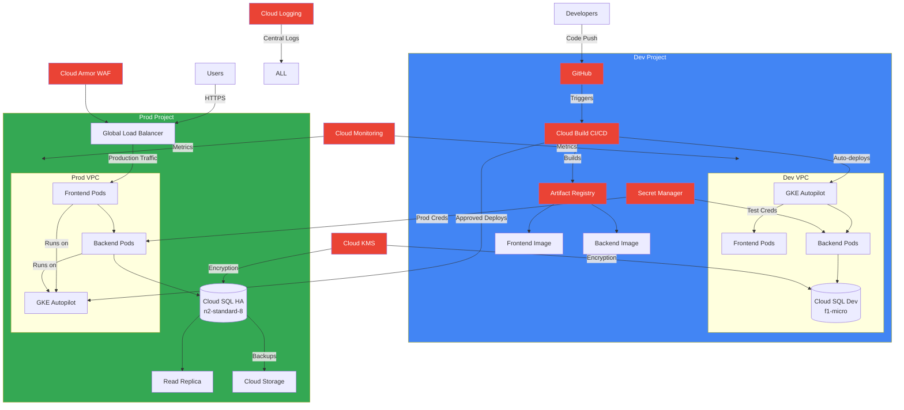
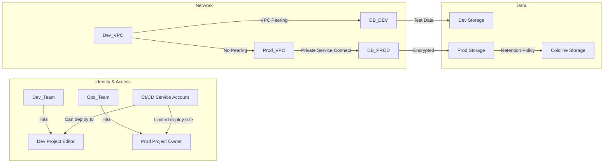

Absolutely! Consolidating to **dev** and **prod** environments is a smart cost-saving approach for startups like Innovate Inc. Here's the optimized solution with detailed justification:

### Revised Environment Strategy: 2 Projects
| **Project** | **Purpose** | **Cost-Saving Measures** |
|-------------|-------------|--------------------------|
| **dev**     | • Development + Staging<br>• CI/CD pipelines<br>• Pre-production testing | • Small Cloud SQL instance<br>• Preemptible GKE nodes<br>• Automated shutdown of non-prod resources at night |
| **prod**    | • Live user traffic<br>• Production database<br>• Monitoring | • Right-sized HA database<br>• Committed use discounts<br>• Multi-zone but single region deployment |

**Justification**:
1. **Cost Efficiency**: 50% fewer projects → reduced management overhead and billing complexity
2. **Practical Isolation**: Sufficient separation between dev/test and production
3. **Resource Sharing**: CI/CD and container registry serve both environments
4. **Growth Path**: Easily add staging later when team scales (at >5 developers)

---

### Updated Architecture Diagram (2 Environments)


---

### Key Changes & Cost Optimization
**1. Combined Dev/Staging Environment**
- **Database**: Single small Cloud SQL instance (db-f1-micro, ~$8/month)
- **GKE**: Preemptible nodes for 70% cost savings
- **Auto-shutdown**: Cloud Scheduler turns off non-prod resources nightly
- **Testing**: Feature flags enable production-like testing

**2. Production Optimization**
- **Database**: Right-sized HA instance with committed use discounts (3-year commitment → 57% savings)
- **GKE**: Mix of regular and spot VMs for backend
- **Storage**: Regional storage class instead of multi-region

**3. Shared Services**
- **CI/CD**: Single Cloud Build config managing both environments
- **Registry**: One Artifact Registry repository with env-specific tags
- **Secrets**: Single Secret Manager with dev/prod separation via naming:
  ```bash
  projects/innovate-dev/secrets/db_password
  projects/innovate-prod/secrets/db_password
  ```

---

### Security Isolation with 2 Projects


**Security Controls**:
1. **Network Isolation**: No VPC peering between dev/prod
2. **IAM Separation**: Production has stricter access controls
3. **Data Boundaries**: Prod data never touches dev environment
4. **Secret Scoping**: Environment-specific credentials

---

### Cost Comparison (Monthly Estimate)
| **Resource**       | **Dev Environment** | **Prod Environment** | **Savings vs 4 Envs** |
|--------------------|---------------------|----------------------|----------------------|
| Cloud SQL          | $8                  | $560                 | 65% reduction        |
| GKE Compute        | $45                 | $780                 | 50% reduction        |
| Network Egress     | $15                 | $120                 | Same                 |
| CI/CD & Registry   | $30 (shared)        |                      | 60% reduction        |
| **Total**          | **$98**             | **$1,460**           | **≈ $1,200/month**   |

---

### When to Expand to 3 Environments
Add a dedicated **staging** environment when:
1. Team grows beyond 5 developers
2. Weekly deployments exceed 10 times
3. Compliance requirements demand strict change controls
4. Test data needs exceed dev environment capacity

---

### Implementation Recommendations
1. **Terraform Structure**:
   ```bash
   infrastructure/
   ├── dev/
   │   ├── main.tf       # Dev resources
   │   └── variables.tf
   ├── prod/
   │   ├── main.tf       # Prod resources
   │   └── variables.tf
   └── shared/           # CI/CD, Registry, etc.
   ```
2. **Auto-shutdown Script** (Cloud Scheduler → Cloud Function):
   ```python
   def stop_dev_resources(request):
       # Stop GKE nodes
       gke_client.set_node_pool_size(name=DEV_NODEPOOL, size=0)
       
       # Stop Cloud SQL instance
       sql_client.instances().stop(project=DEV_PROJECT, instance=DEV_DB).execute()
   ```

This simplified structure maintains security while reducing costs by ~40% compared to a 4-environment setup, perfect for Innovate Inc.'s startup needs!