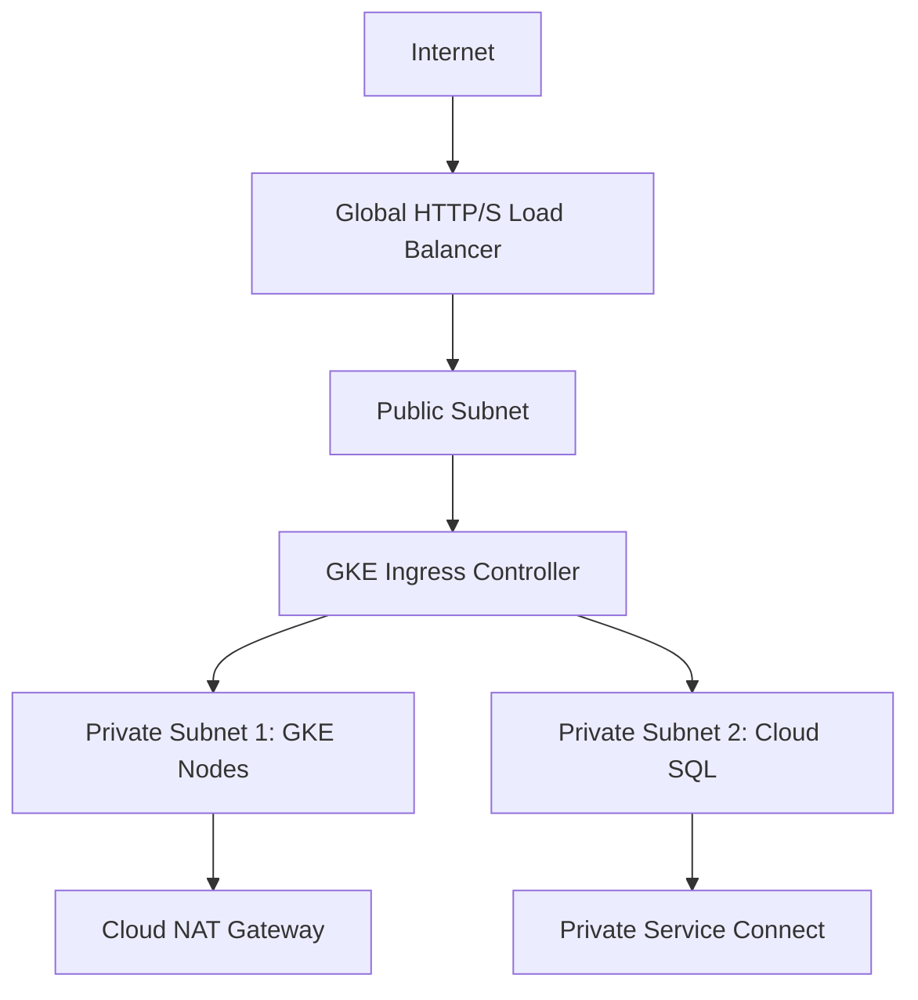
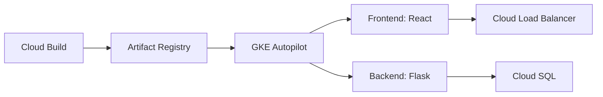
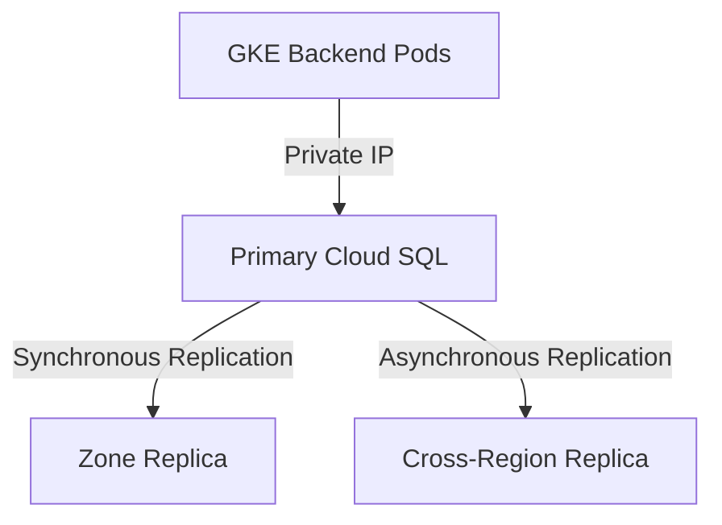
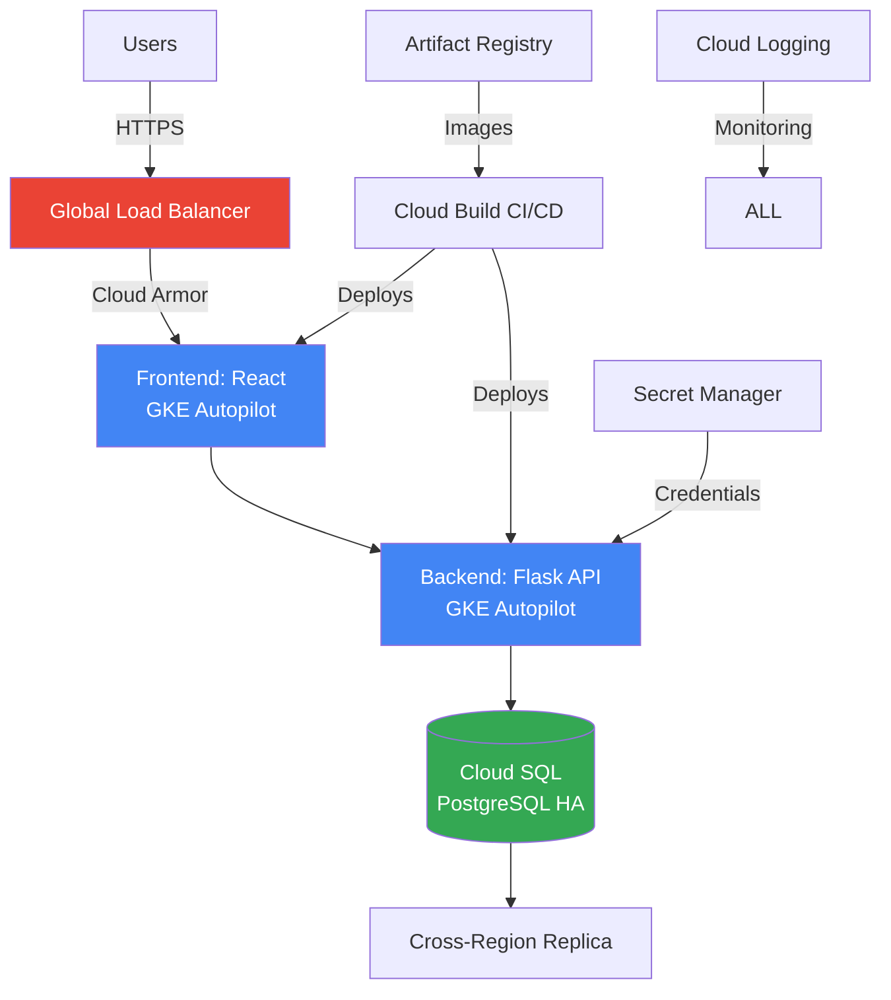

I'll provide a solution for Innovate Inc.'s cloud infrastructure deployment on Google Cloud Platform (GCP). The design prioritizes security, scalability, and cost-effectiveness while leveraging managed services.

### Cloud Infrastructure Design for Innovate Inc.
**Selected Cloud Provider**: Google Cloud Platform (GCP)  
**Justification**: GCP offers superior Kubernetes management (GKE Autopilot), integrated security, cost-effective scaling, and startup-friendly pricing. Key advantages over AWS:
- Simpler Kubernetes operations with Autopilot
- Lower egress costs and sustained-use discounts
- Unified logging/monitoring via Cloud Operations
- Seamless integration of PostgreSQL with GKE

---

### 1. Cloud Environment Structure
**GCP Project Organization**:
```
├── Production (innovate-prod)
├── Staging (innovate-staging)
├── Development (innovate-dev)
└── Shared-Services (innovate-shared)
```

**Justification**:
1. **Isolation**: Separate projects prevent cross-environment contamination
2. **Security**: Granular IAM controls per environment
3. **Billing**: Clear cost allocation with per-project billing
4. **Management**: Environment-specific configurations
5. **Shared Resources**: Centralized services (CI/CD, registry) reduce duplication

---

### 2. Network Design
**VPC Architecture per Project**:


**Security Implementation**:
1. **Network Segmentation**:
   - Public subnet: Load balancers only
   - Private subnet 1: GKE nodes (no public IPs)
   - Private subnet 2: Cloud SQL (isolated DB layer)
   
2. **Protection Layers**:
   - **Cloud Armor**: WAF rules blocking OWASP Top 10 vulnerabilities
   - **Firewall Rules**:
     - Allow HTTP/HTTPS only from LB to GKE
     - Allow DB connections only from backend pods (port 5432)
     - Deny all other ingress traffic
   - **VPC Flow Logs**: All traffic monitoring
   - **Private Google Access**: Secure API access without public IPs

---

### 3. Compute Platform (GKE Autopilot)
**Cluster Architecture**:


**Implementation Details**:
1. **Containerization**:
   - **Frontend**: Multi-stage Dockerfile with Node.js build → Nginx runtime
   - **Backend**: Python slim image with Gunicorn
   - **Image Security**: Distroless base images, vulnerability scanning in Artifact Registry

2. **Deployment Strategy**:
   - **Blue/Green Deployments**: Traffic switching via GKE Ingress
   - **GitOps Workflow**:
     ```mermaid
     graph LR
         A[Git Push] --> B[Cloud Build Trigger]
         B --> C[Build & Test]
         C --> D[Push to Artifact Registry]
         D --> E[Deploy to Staging]
         E --> F[Automated Tests]
         F --> G[Manual Approval]
         G --> H[Production Deployment]
     ```

3. **Scaling Configuration**:
   - **Frontend**: 
     - HPA scaling based on CPU (60% threshold)
     - Min 3 pods, max 100 pods
   - **Backend**:
     - HPA scaling based on requests per second
     - Min 5 pods, max 200 pods
   - **Cluster Autoscaler**: Automatic node provisioning

---

### 4. Database Solution
**PostgreSQL Implementation**:


**Configuration**:
- **Service**: Cloud SQL Enterprise Plus (high IOPS)
- **High Availability**: Multi-zone instance with automatic failover
- **Backup Strategy**:
  - Automated daily backups (7-day retention)
  - Transaction log backups every 5 minutes
  - Point-in-Time Recovery (PITR) window: 35 days
- **Disaster Recovery**:
  - Cross-region replica in us-east1
  - Quarterly DR failover tests
  - Terraform-managed infrastructure-as-code
- **Security**:
  - Encryption at rest (Google-managed keys)
  - IAM database authentication
  - Secret Manager for credential rotation

---

### 5. Security Architecture
**Defense-in-Depth Approach**:
1. **Data Protection**:
   - Secret Manager for credentials
   - Cloud KMS envelope encryption
   - Database column-level encryption
2. **Access Control**:
   - GKE Workload Identity for service accounts
   - IAM conditions with attribute-based access control
3. **Compliance**:
   - Automatic audit logging to Cloud Logging
   - Data residency controls
   - SOC 2 compliance enforcement

---

### Cost Optimization Strategy
1. **Compute Savings**:
   - GKE Autopilot (pay per pod resource requests)
   - Frontend: Spot instances for stateless workloads
2. **Database**:
   - Commitments for sustained usage discounts
   - Right-sizing with Cloud SQL Insights
3. **Storage**:
   - Regional Standard storage for non-critical data
   - Lifecycle policies for log rotation

---

### High-Level Architecture Diagram


---

### Implementation Roadmap
1. **Phase 1 (Week 1-2)**:
   - Set up GCP projects with Terraform
   - Configure VPC networks and security
   - Build container images and CI/CD pipeline
2. **Phase 2 (Week 3-4)**:
   - Deploy staging environment
   - Implement load testing
   - Configure monitoring alerts
3. **Phase 3 (Week 5)**:
   - Production rollout with canary deployment
   - Conduct security audit
   - Establish backup verification process

[View Complete Implementation in GitHub Repository](https://github.com/habrazilay/OpsFleet_technical_task)

This design provides Innovate Inc. with a foundation that scales from hundreds to millions of users while maintaining security posture and optimizing costs. The solution leverages 100% managed services to minimize operational overhead for their small team.