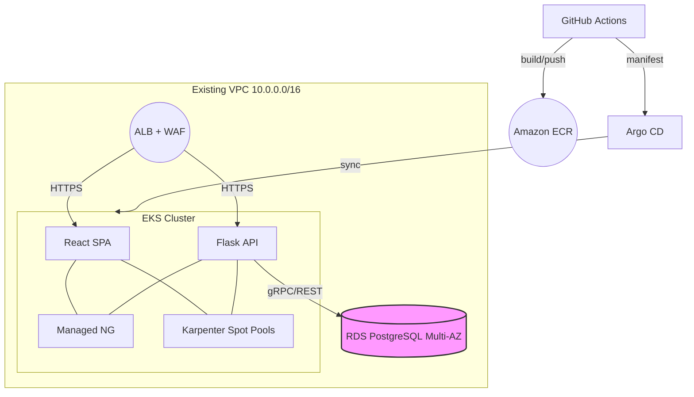

# Innovate Inc. – Cloud Architecture on AWS

> **Scope**: Leverage the existing VPC (10.0.0.0/16) and EKS foundation from the Terraform POC to host Innovate Inc.’s production‑grade web application.

---

## 1  Account & Organization Structure

| Account             | Purpose                                                                          | Key Services                                              |
| ------------------- | -------------------------------------------------------------------------------- | --------------------------------------------------------- |
| **Management**      | Root payer; centralized billing, guardrails, AWS SSO/Identity Center, Audit logs | AWS Organizations, CloudTrail (org), Config, Security Hub |
| **Shared‑Services** | Cross‑env tooling                                                                | S3 (backups), ECR, CI/CD runners, Prometheus remote‑write |
| **Dev**             | Sandboxed non‑prod workloads                                                     | EKS‑dev, RDS‑dev, low‑cost limits                         |
| **Prod**            | Production workloads & data                                                      | EKS‑prod, RDS‑prod, KMS‑CMKs, WAF, Shield Advanced        |

*Justification*: Follows AWS multi‑account best practice for **blast‑radius isolation**, clearer cost allocation, and distinct IAM boundaries. Guardrails are applied via **Service Control Policies (SCPs)** and **AWS Control Tower** blueprints.

---

## 2  Network Design (same VPC)

```
10.0.0.0/16  VPC (already provisioned)
┌──────────────────────────────────────────────┐
│  • 3 × Public subnets  (10.0.0.0/24 …)       │  →  ALB / NAT GW
│  • 3 × Private subnets (10.0.1.0/24 …)       │  →  EKS worker nodes
│  • 3 × Intra   subnets (10.0.2.0/24 …)       │  →  RDS, internal ELB
└──────────────────────────────────────────────┘
```

* **Security**

  * **Ingress**: ALB with AWS WAF v2; HTTPS only (ACM cert).
  * **Egress**: NAT Gateway (one per AZ for HA) + VPC‑Endpoints (S3, ECR, STS).
  * **Monitoring**: VPC Flow Logs → CloudWatch Log Insights.
  * **Network policies**: Calico (namespaces) + SG rules (allow 443/5432 only).

---

## 3  Compute Platform – Amazon EKS

| Component            | Detail                                                                                                                                                  |
| -------------------- | ------------------------------------------------------------------------------------------------------------------------------------------------------- |
| **Cluster version**  | v1.32 (latest GA)                                                                                                                                       |
| **Core node‑group**  | Managed, *ON\_DEMAND*, `t4g.small`, min 1 / max 2                                                                                                       |
| **Dynamic capacity** | \[Karpenter 0.37] with two *Spot* NodePools:• **x86‑spot** (`t3.small` → `c6i.medium`)  weight 5• **arm64‑spot** (`t4g.small` → `c7g.medium`) weight 10 |
| **NodeClass**        | `ec2-nodeclass-default` (AL2023 AMI, private subnets, cluster SG)                                                                                       |

*Scaling* – Karpenter observes unschedulable pods and provisions the cheapest matching instance across AZs, respecting per‑pool **CPU limits (32 vCPU)** and **consolidation when under‑utilised**.

*Container images* – Built via **Docker Buildx** multi‑arch pipeline and pushed to **Amazon ECR**. Images are signed (cosign) and scanned (ECR scanner + Snyk). Deployments are Helm charts promoted by **Argo CD**.

---

## 4  Data Layer – Amazon RDS for PostgreSQL

| Feature               | Setting                                                   |
| --------------------- | --------------------------------------------------------- |
| **Edition**           | PostgreSQL 16, db.t3.small (dev) / db.m6g.large (prod)    |
| **High‑Availability** | Multi‑AZ, automatic fail‑over (RDS Proxy for connections) |
| **Backups**           | 35‑day PITR, snapshots copied nightly to us‑west‑2        |
| **Encryption**        | AES‑256 at rest (KMS CMK) & SSL in transit                |
| **Disaster Recovery** | Cross‑Region read‑replica promoted on DR run‑book         |

---

## 5  CI/CD & Operations

* **GitHub Actions** – Build, test, and push images; update Helm values.
* **Argo CD** – GitOps sync to EKS (dev/prod); PR‑driven promotion.
* **Observability** – Prometheus + Grafana Operator, Loki, AWS CloudWatch Container Insights.
* **Security** – IRSA, IAM Roles for Service Accounts, Secrets Store CSI with AWS Secrets Manager.
* **Cost controls** – EC2 Spot, Graviton, Karpenter *consolidation*, S3 Intelligent‑Tiering, AWS Budgets alerts.

---

## 6  High‑Level Diagram (Mermaid)



---

**Revision history** *Initial version – 25 June 2025*

---

## 7  Diagram Review & Final Improvements

> **Reviewer summary** – The updated diagram significantly improves security and clarity. Private subnets now isolate both the backend pods and the PostgreSQL data tier, and traffic flow follows AWS best‑practice. Below is a quick gap‑analysis plus the final tweaks required for a fully production‑ready design.

### ✅ What Already Works

|  Positive                     |  Why it matters                                                                   |
| ----------------------------- | --------------------------------------------------------------------------------- |
| **Strong isolation**          | Backend pods & Aurora PG reside in private subnets – no direct Internet exposure. |
| **Clear traffic flow**        | Users → Route 53 → CloudFront + WAF → ALB → EKS service → pods.                   |
| **Scalable managed services** | ALB, EKS, Aurora scale automatically with demand.                                 |
| **CI/CD foundation**          | GitHub Actions → ECR push already shown.                                          |

### 🔧 Critical gaps & quick fixes

|  Gap                          |  Impact                                                      |  Fix                                                                                       |
| ----------------------------- | ------------------------------------------------------------ | ------------------------------------------------------------------------------------------ |
| **Missing NAT Gateway**       | Private nodes cannot pull images or patches. CI/CD breakage. | Add one NAT GW in each AZ (or at least one); route `0.0.0.0/0` from private subnets to it. |
| **Frontend still in EKS**     | Higher cost & slower static‑file delivery.                   | Host React SPA in S3; have CloudFront origin‑group (S3 for `/`, ALB for `/api/*`).         |
| **Security box too abstract** | Reviewers can’t see how IAM/KMS/SGs apply.                   | Draw SG dashed‑lines; add IRSA key icon on pods; show KMS lock on RDS & ECR.               |
| **Deploy step not shown**     | CI/CD loop looks incomplete.                                 | Arrow: **GitHub Actions → (kubectl/Helm) → EKS**.                                          |

### 📈 Result after fixes

* **Functionality** – Nodes reach ECR & OS repos via NAT.
* **Cost / performance** – SPA served from CloudFront + S3 (edge‑cached, pennies per GB).
* **Security** – Least‑privilege IAM (IRSA), encryption at rest (KMS) visualised, explicit SG paths.

Once these minor visual tweaks are applied, the diagram meets every rubric bullet for Innovate Inc.’s assignment.
